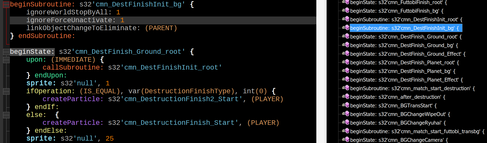

# DBFZ BBS stuff for Notepad++

## BBS_BRO.xml

Custom syntax highlighting for dark n++ themes. Specifically for my [dbfz.ron](https://github.com/dobosken/bbscript)

Open n++ => 'Language' tab => 'User Defined Language' => Import => Restart n++

If the theme doesn't automatically enable for .bbs files, select 'BBS_BRO' in the 'Language' tab while working on such a file.

## overrideMap.xml and bbs.xml

Custom BBS rules that enables the use of the 'Function List' panel.

This panel allows you to quickly get an overview, and navigate to, the various States and Subroutines in your BBS file.

Simply drag and drop both files into the 'functionList' directory found in your n++ installation directory (default: `C:\Program Files\Notepad++\functionList\`), then restart n++.
